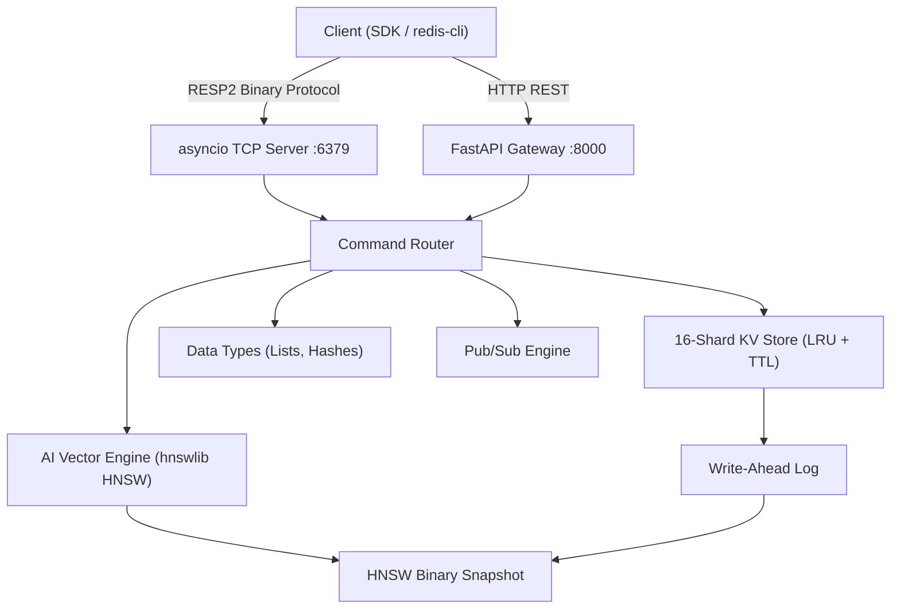

<div align="center">

# ⚡ PulseDB

**An enterprise-grade, in-memory database with a native AI Vector Engine.**

Built for developers who need Redis-compatible storage *and* lightning-fast semantic search — without running two separate systems.

[](https://github.com/gkavinrajanCodes/pulseDB/actions)
[](https://pypi.org/project/pulsedb/)
[](LICENSE)

</div>

---

## What is PulseDB?

PulseDB is a high-performance, open-source database that combines:

- **A Redis-compatible KV store** — Strings, Lists, Hashes with TTL, LRU eviction, and RESP2 wire protocol
- **An AI Memory Engine** — HNSW-based vector search with native C++ pre-filtering callbacks
- **A Python SDK** — Ergonomic `db.vectors.upsert()` / `db.vectors.search()` API
- **A LangChain Integration** — Drop-in `PulseDBVectorStore` for RAG pipelines with metadata filtering

> One server, one protocol, one SDK. No Pinecone. No Weaviate. No Redis Stack.

---

## Features

| Category | Capability |
|---|---|
| **KV Store** | `SET`, `GET`, `DEL`, `EXPIRE`, `TTL`, `MSET`, `MGET`, `INCR`, `APPEND` |
| **Data Types** | Strings · Lists (`LPUSH/RPOP/LRANGE`) · Hashes (`HSET/HGET/HGETALL`) |
| **Vector Engine** | HNSW cosine similarity, O(log N) search, dynamic resizing |
| **Hybrid Search** | Native C++ pre-filter callbacks — filter by metadata *during* graph traversal |
| **Persistence** | Write-Ahead Log (WAL) + JSON snapshots + HNSW binary graph snapshots |
| **Protocol** | RESP2 TCP (port 6379) — works with `redis-cli`, `redis-py`, `ioredis` |
| **Cluster** | Consistent hashing, multi-node routing |
| **Auth** | API Key (HTTP) + `REQUIREPASS` (TCP) + optional TLS/SSL |
| **Observability** | Prometheus `/metrics` endpoint, structured `/health` and `/ready` |
| **LangChain** | `PulseDBVectorStore` with `similarity_search(filter={...})` |

---

## Quickstart

### 1. Run the Server (Docker)

```bash
docker run -d \
  -p 6379:6379 \
  -p 8000:8000 \
  -v pulsedb_data:/app/data \
  --name pulsedb \
  ghcr.io/gkavinrajancodes/pulsedb:latest
```

Or use Docker Compose for a 3-node cluster:

```bash
git clone https://github.com/gkavinrajanCodes/pulseDB.git
cd pulseDB && docker-compose up --build
```

### 2. Install the SDK

```bash
pip install pulsedb
```

### 3. Use It

```python
from pulsedb import PulseDB

db = PulseDB(host="localhost", port=6379)

# Standard KV Store
db.set("session:abc", "user_data", ttl=3600)
print(db.get("session:abc"))  # "user_data"

# AI Memory Engine — insert vectors with metadata
db.vectors.upsert("article:1", [0.12, 0.98, 0.34], metadata={"category": "sports", "year": 2024})
db.vectors.upsert("article:2", [0.91, 0.11, 0.67], metadata={"category": "tech", "year": 2023})

# Semantic similarity search — optionally filter by metadata
results = db.vectors.search([0.10, 0.95, 0.40], top_k=5, filter={"category": "sports"})
# → [{"id": "article:1", "score": 0.997}]
```

---

## LangChain Integration

PulseDB works natively as a LangChain VectorStore, giving your RAG pipeline blazing fast retrieval with hybrid metadata filtering.

```python
from langchain_openai import OpenAIEmbeddings
from sdk.langchain_pulsedb.vectorstore import PulseDBVectorStore

store = PulseDBVectorStore(
    embedding=OpenAIEmbeddings(),
    host="localhost",
    port=6379,
)

# Ingest documents — metadata is automatically stored for hybrid filtering
store.add_texts(
    texts=["PulseDB is fast", "Redis is popular", "Pinecone is expensive"],
    metadatas=[{"source": "blog"}, {"source": "wiki"}, {"source": "review"}]
)

# Hybrid search — find similar docs but only from the blog source
docs = store.similarity_search("fast database", k=2, filter={"source": "blog"})
```

---

## How the AI Memory Engine Works

Standard vector databases do **post-filtering**: search all vectors, get K results, then throw away the ones that don't match the filter. This degrades accuracy.

PulseDB does **true pre-filtering** using native `hnswlib` C++ filter callbacks. The filter function is evaluated *inside* the graph traversal — so the C++ engine skips disqualified nodes entirely before scoring them.

```
Query Vector → HNSW Graph Traversal → [Filter Callback runs on every node visited]
                                        ↓ Pass → included in result set
                                        ↓ Fail → skipped immediately
                                       Top-K results returned
```

This means your effective `top_k` is always accurate, even with highly restrictive filters.

---

## Architecture



---

## Run Locally (From Source)

```bash
# 1. Clone and install
git clone https://github.com/gkavinrajanCodes/pulseDB.git
cd pulseDB
python3.10 -m venv workenv && source workenv/bin/activate
pip install -r requirements.txt

# 2. Start the server
NODE_ID=node1 CLUSTER_NODES=node1 uvicorn server.main:app --host 0.0.0.0 --port 8000

# 3. Install the SDK (in another terminal)
pip install -e sdk/
```

---

## Contributing

1. Fork the repository
2. Create a feature branch: `git checkout -b feature/sorted-sets`
3. Commit your changes: `git commit -m "feat: add ZADD/ZRANGE sorted set commands"`
4. Push: `git push origin feature/sorted-sets`
5. Open a Pull Request

All PRs are validated against our CI matrix (Python 3.10, 3.11, 3.12 with flake8, mypy, and pytest).

---

## License

Distributed under the Business Source License (BSL 1.1). See [LICENSE](LICENSE) for details.
