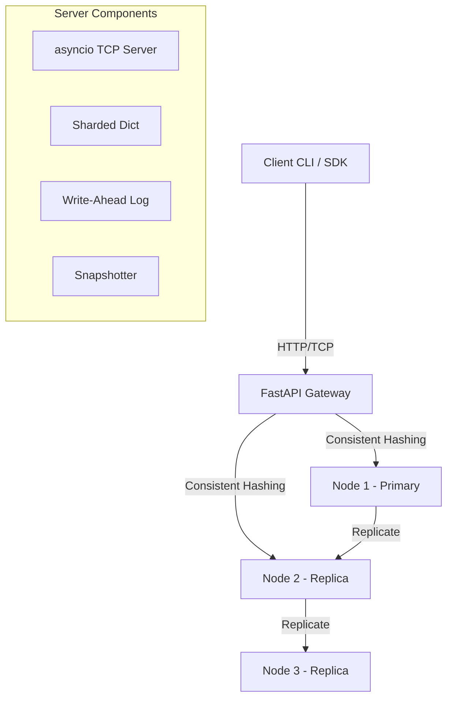

# PulseDB Cloud

PulseDB Cloud is a high-performance, production-grade distributed in-memory data system inspired by Redis, designed for real-time applications and ephemeral state management.

## Features

- **Blazing Fast In-Memory Store**: `O(1)` average read/write complexity using a 16-shard internal architecture to minimize lock contention.
- **Distributed Architecture**: Multi-node horizontal scalability utilizing **Consistent Hashing** and **Primary-Replica Replication**.
- **Real-Time Pub/Sub**: Push-based messaging via WebSockets and TCP loops.
- **Data Durability**: Features Write-Ahead Logging (WAL) and background snapshotting.
- **Dual Protocols**: Exposes both an HTTP REST API and a Custom Binary TCP interface.
- **Security & Limits**: API Key authentication and rate-limiting middleware.
- **Observability**: Built-in Prometheus metrics exporter and structured health checks.
- **Premium Dashboard**: A glassmorphic web dashboard for real-time live-monitoring (`/dashboard`).

## Quick Start (Docker)

The absolute fastest way to get a 3-node cluster up and running is via Docker Compose:

```bash
git clone https://github.com/yourusername/pulsedb-cloud.git
cd pulsedb-cloud
docker-compose up --build
```
* Node 1 is mapped to HTTP `8001` and TCP `6379`.
* Node 2 is mapped to HTTP `8002` and TCP `6380`.
* Node 3 is mapped to HTTP `8003` and TCP `6381`.

Open `dashboard/index.html` in your web browser to monitor the system in real-time.

## Run Locally (From Source)

**Prerequisites:** Python 3.10+

```bash
# 1. Create a virtual environment
python3.10 -m venv workenv
source workenv/bin/activate

# 2. Install dependencies
pip install -r requirements.txt

# 3. Start the server (Node 1)
PYTHONPATH=$(pwd) NODE_ID=node1 CLUSTER_NODES=node1 \
  uvicorn server.main:app --host 0.0.0.0 --port 8000
```

## Usage

You can interact with PulseDB via the provided CLI tool or using standard toolsets like `curl` and `websockets`.

### CLI Interface
```bash
# General formatting
python client/cli.py <COMMAND> <ARGS>

# Examples
python client/cli.py SET mykey myvalue
python client/cli.py GET mykey
python client/cli.py DEL mykey
python client/cli.py MSET k1 v1 k2 v2
python client/cli.py MGET k1 k2
```

### HTTP REST API
PulseDB implements a generic `/command` endpoint protected by `X-API-Key`.
Default Key: `pulse-db-secret-key`

```bash
curl -X POST http://localhost:8000/command \
  -H "Content-Type: application/json" \
  -H "X-API-Key: pulse-db-secret-key" \
  -d '{"command":"SET","args":["foo","bar"]}'
```

## System Architecture



## Metrics and Monitoring
Prometheus metrics are automatically exported via the `/metrics` endpoint. You can plug this endpoint straight into a Prometheus server to dashboard throughput, open connections, and generic API latencies.

## Contributing
1. Fork the repo.
2. Create a new branch (`git checkout -b feature/awesome-feature`).
3. Commit your changes (`git commit -am 'Add an awesome feature'`).
4. Push to the branch (`git push origin feature/awesome-feature`).
5. Open a Pull Request.

## License
Distributed under the MIT License. See `LICENSE` for more information.
