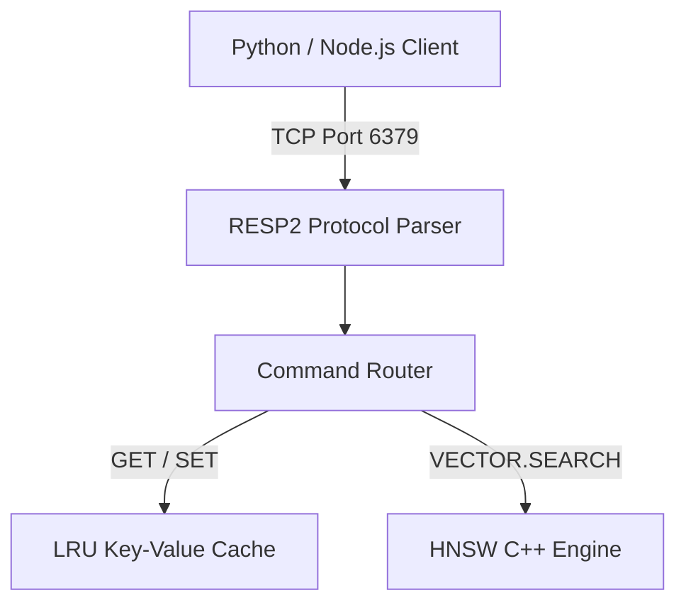

# PulseDB Architecture

PulseDB is fundamentally different from both legacy Key-Value stores and dedicated Vector databases. By unifying both inside a single memory space over an async multiplexed protocol, we achieve microsecond latencies.

## The RESP2 TCP Layer

To maximize compatibility, PulseDB does not use HTTP or gRPC for its core database operations. Instead, it implements a custom `asyncio` TCP server that speaks **RESP2** (Redis Serialization Protocol).

This means that any existing infrastructure that knows how to talk to Redis can immediately talk to PulseDB.

## Vector Search & Inline Pre-Filtering

Most vector databases suffer from the "Post-Filtering Problem". They perform a nearest-neighbor search to find the 10 closest vectors, and *then* they apply metadata filters. If none of those 10 vectors match the filter, the database returns 0 results, even if there are valid matches deeper in the graph.

PulseDB solves this using **Inline C++ Pre-Filtering**.

When a `VECTOR.SEARCH` command is received with a metadata filter (`{"department": "engineering"}`), PulseDB injects a Python callback directly into the C++ `hnswlib` traversal algorithm. The C++ engine checks the metadata of every node *before* it considers it a valid neighbor. This guarantees 100% accurate recall without sacrificing speed.

## Durability & Persistence

In-memory databases are fast, but they are volatile. PulseDB ensures durability through a two-pronged approach:

1.  **Write-Ahead Log (WAL):** Every single mutation (`SET`, `DEL`, `VECTOR.UPSERT`) is immediately appended to a binary log file (`pulsedb.wal`) before the client receives an `OK` response.
2.  **Background Snapshots:** Periodically, a background thread forks and writes the entire KV state to `pulsedb.snapshot` and the HNSW graph to `pulsedb.hnsw`. After a successful snapshot, the WAL is truncated.

If the server loses power, it boots up, loads the last snapshot, replays the WAL, and perfectly recovers its state.
